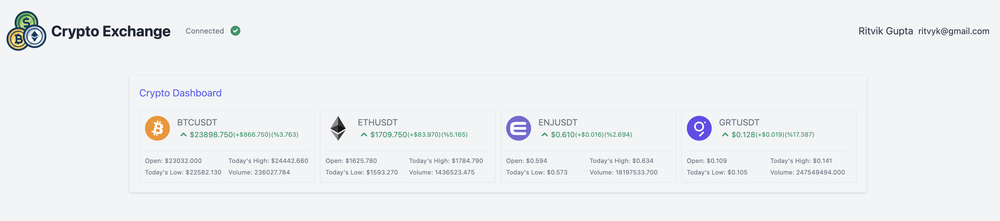

# Getting started with crypto exchange React Node App 🚀

This project is created using binance API , React as frontend and Node as Backend.

## Available Scripts

In the project directory, you can run:

### `yarn start`

cd client \
yarn start

### `yarn test`

Launches a test runner for the server \
cd server \
yarn run test
